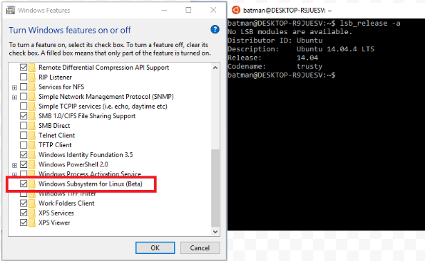

So I just updated my windows with Windows Anniversary Update and enable ubuntu bash in my machine. For those who wants to enable ubuntu bash, go to "Turn Windows Features on or off" and enable "Windows Subsystem for Linux".

Aaand, I got ubuntu 14.04 on my Windows 10!



Then I started my adventure 


I set up python environment (pip, virtualenv, etc) and cloned my blog repo (which is using Pelican). While doing that, I faced a problem where it doesn't recognize its hostname:

```
$ sudo chown -R batman:batman /home/batman/
sudo: unable to resolve host DESKTOP-R9JUESV
```

If you face the same issue, you can edit `/etc/hosts` and add `127.0.0.1 localhost yourMachineHostname`.

In my case, it's `127.0.0.1 localhost DESKTOP-R9JUESV`.

After the hostname issue is resolved, I feel like I was working on Ubuntu native, without any problem. In fact, this post is created using my Windows machine :)

tl dr: I think this feature is really promising since I don't have any big issue. Time to remove ubuntu partition on your machine and use this instead? :D