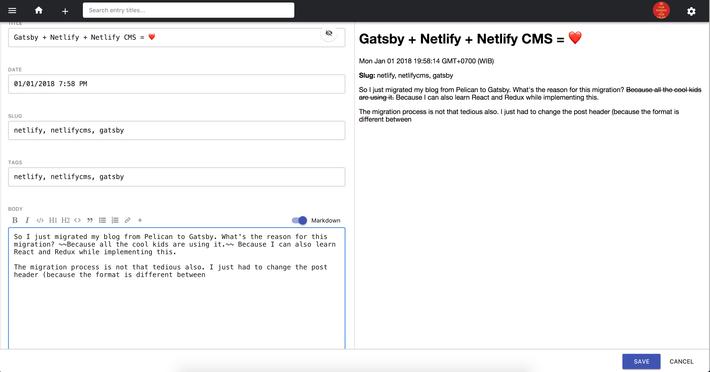

So I just migrated my blog from Pelican to Gatsby. What's the reason for this migration? ~~Because all the cool kids are using it.~~ Because I can also learn React and Redux while implementing this.

The migration process is not that tedious also. I just had to change the post header (because the format is different between Pelican & Gatsby), edit the template, and install the Netlify CMS.

Was it worth it? Yesss I believe so. Especially because Netlify part. Previously when I use Pelican, I had to create a Markdown post, try it locally, and then deploy it afterwards. With Netlify, I just need to go to the admin page, add a new post (with the beautiful editor), and merge the pull request when I think it's good enough. In case you want to install Netlify CMS, they made [this great post](https://www.netlifycms.org/docs/add-to-your-site). Happy new year!

The editor:

